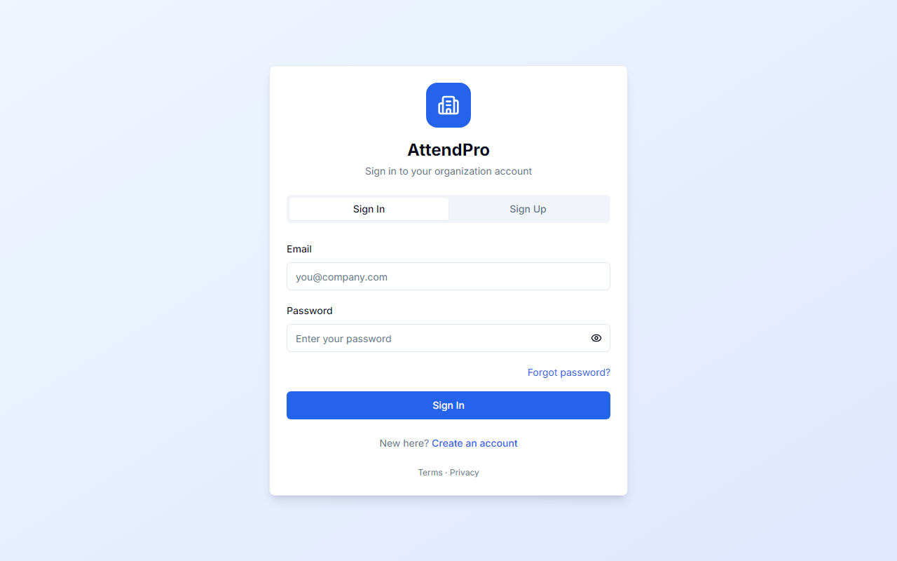
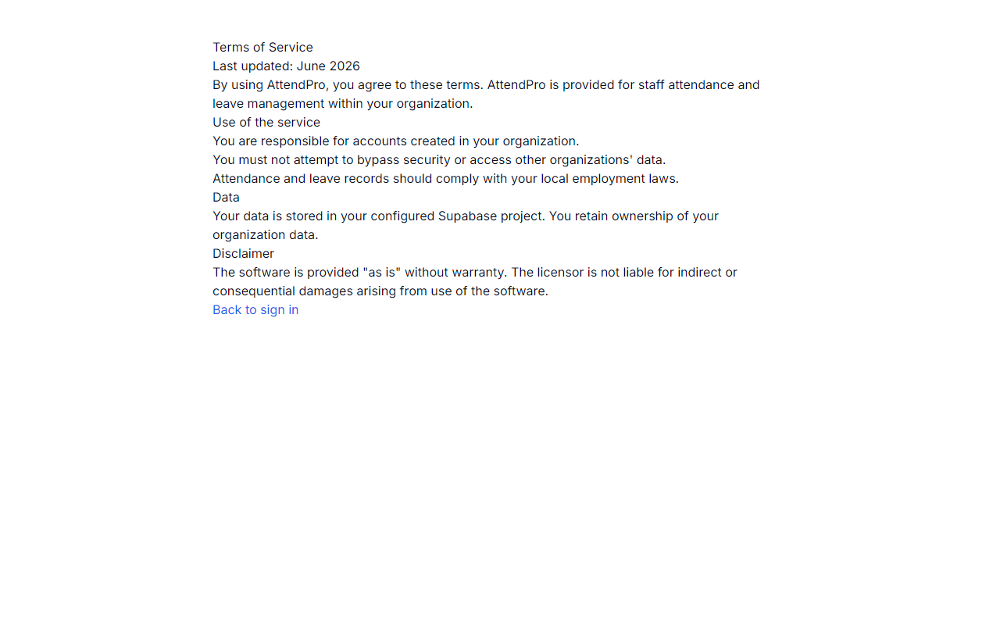
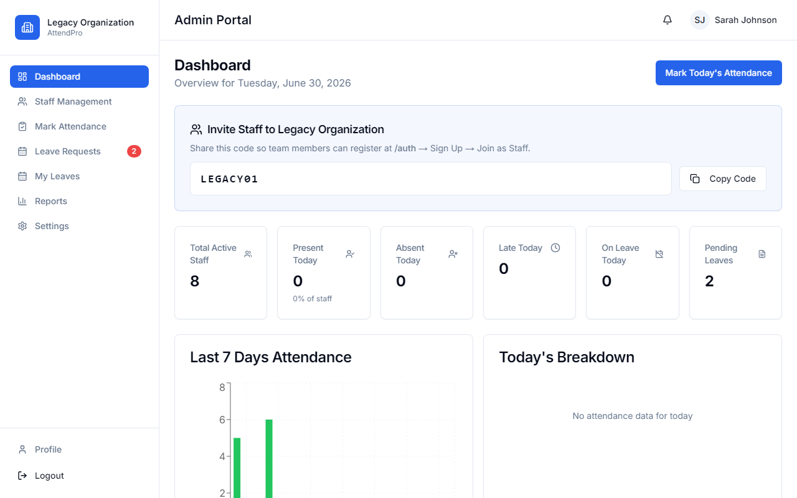
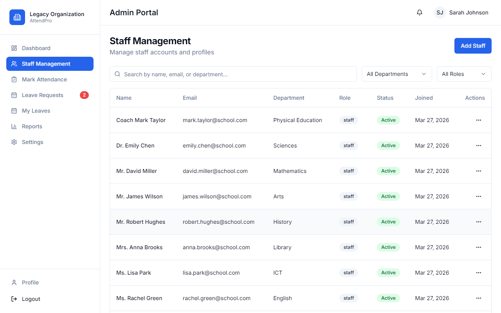
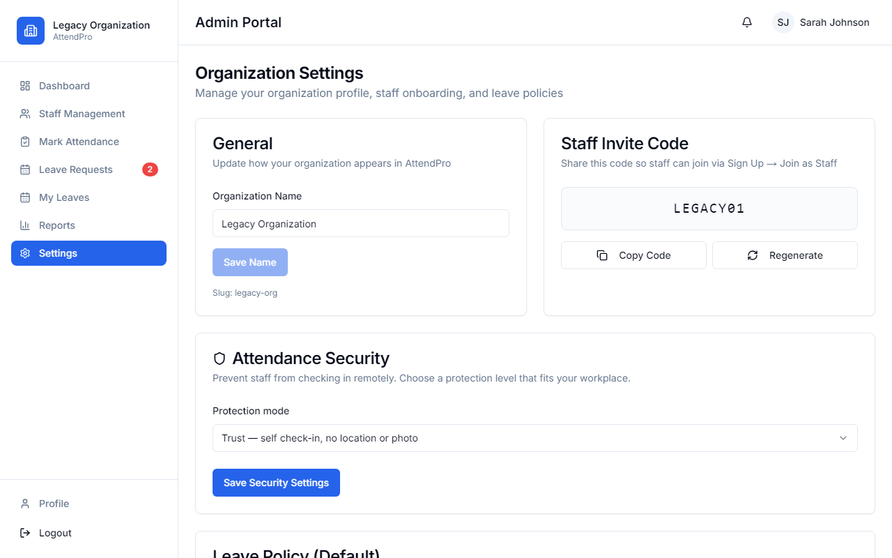
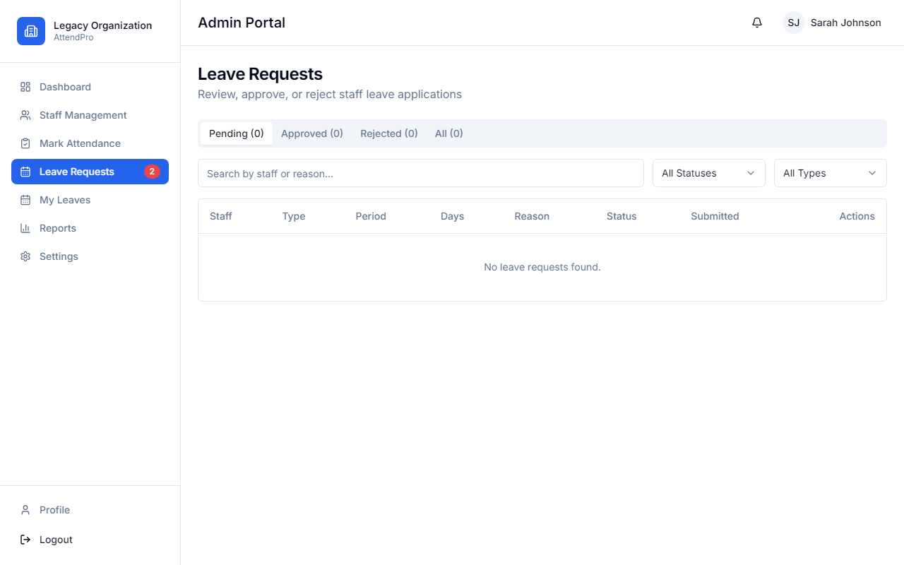

# AttendPro — Project Report

**Student project:** Staff Attendance & Leave Management System  
**Version:** 1.0.0 | **Stack:** Next.js 14, TypeScript, Supabase, Tailwind CSS  
**Live demo:** https://staff-attendance-system-tau.vercel.app/auth  
**Repository:** https://github.com/Akinlekan/staff-attendance-system

---

## 1. Problem & objective

Organizations still rely on manual attendance sheets and informal leave requests. This leads to errors, delayed approvals, and **buddy punching** (one person checking in for another). **AttendPro** is a web application that digitizes attendance, leave workflows, and admin reporting with role-based access and optional anti-cheat verification.

## 2. Solution overview

| Role | Capabilities |
|------|----------------|
| **Admin** | Dashboard, staff CRUD, bulk attendance, leave approval, reports (CSV), org settings, QR kiosk |
| **Staff** | Self check-in/out, calendar, leave requests, profile, video face enrollment, notifications |

**Protection modes:** Trust (basic) → Standard (geofence + video + face) → Strict (+ rotating QR) → Admin-only.

## 3. Architecture

```
Browser (React/Next.js) → Server Actions + Middleware → Supabase (Auth, PostgreSQL, RLS, Storage)
```

- **Multi-tenant:** Organizations with invite codes; data isolated by `organization_id` and RLS policies.  
- **Security:** CSP/HSTS headers, rate limiting on auth, audit logs, DB triggers blocking invalid self check-in.  
- **Deploy:** Vercel (frontend) + Supabase (backend).

## 4. Key screenshots

### Authentication & legal pages

| | |
|:---:|:---:|
|  |  |
| Unified auth (`/auth`) | Terms of service |

### Admin experience

| | |
|:---:|:---:|
|  |  |
| KPIs & charts | Staff list & actions |

| | |
|:---:|:---:|
|  |  |
| Office location & protection mode | Approve / reject leave |

## 5. Demo credentials (production)

| Role | Email | Password |
|------|-------|----------|
| Admin | `admin@school.com` | `Admin1234!` |
| Staff | `emily.chen@school.com` | `Staff1234!` |

After local seed (`npm run seed`): `admin@demo.com` / `Admin1234!`, invite code **DEMO2026**.

## 6. Testing performed

- Production build passes (`npm run build`).
- Supabase migrations 005–007 applied (secure check-in schema, audit logs, storage buckets).
- Manual flows: login, dashboard, staff, leaves, settings, logout.

## 7. Limitations & future work

- Video liveness uses browser APIs (not native Face ID); requires camera + GPS for Strict mode.
- Rate limiting is in-memory (resets on server restart).
- Possible extensions: payroll export, mobile app, SMS notifications.

---

**Submitted by:** ___________________  
**Date:** ___________________  
**Institution / course:** ___________________
